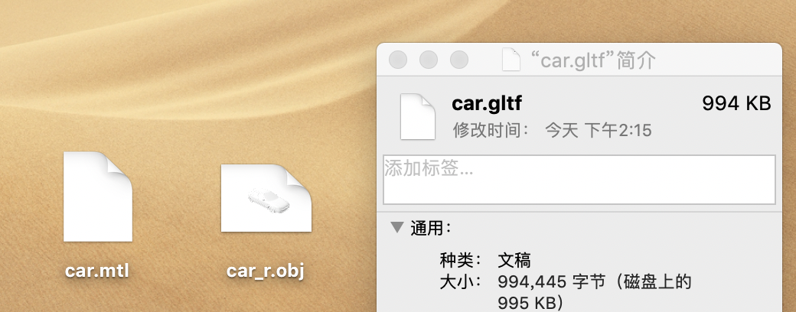

# Threejs in autonomous driving -（2）模型精简

> 在开发准备阶段建模同学都会提供一个`车模`, 从前段考量一般来说超过100kb都算是大文件了，这个模型一般是`obj`+`mtl`文件，这两个一般都会超过MB。推动精简的话都非常都难。

## 精简方案

1. 删减模型的`顶点`和`面片`
2. 模型压缩

第一种专业性比较强，我们是搞不定的，那么就可以从第二种思路为出发点。通过万能的搜索引擎搜索我们可以找到被誉为3d业界的json格式的gltf。

[gltf](https://www.khronos.org/gltf/)简介。

这里推荐两个工具

- [obj2gltf](https://www.npmjs.com/package/obj2gltf) https://www.npmjs.com/package/obj2gltf
- [gltf-pipeline](https://www.npmjs.com/package/gltf-pipeline) https://www.npmjs.com/package/gltf-pipeline

### obj2gltf和gltf-pipeline

利用`obj2gltf`和gltf这个工具可以把obj+mtl格式转为gltf, gltf-pipeline可以进一步把gltf转为glb（binary）这样可以得到一个非常小的模型文件。


```
$user obj2gltf -i car_r.obj -o car.gltf

```


可以看到转换后得到一个非常小的文件，`gltf-pipeline`使用不在赘述。在threejs中可以使用gltfloader来使用gltf或者glb文件！

```javascript

export
let gltfLoader = function (gltfSrc) {
    return new Promise((resolve, reject) => {
        new THREE.GLTFLoader()
            .load(gltfSrc,
                ({scene}) => resolve(scene),
                noop,
                error => reject({
                    type: 'gltf'
                })
            );
    });
};

```

结语：通过对glb格式的模型的使用，我们发现相对于obj格式的模型。不论是加载速度还是解析渲染速度都有了质的飞跃。完全没有了obj带来的卡顿感觉。

---
- 我的blog: [neverland.github.io](https://neverland.github.io/)
- 我的email [enix@foxmail.com](enix@foxmail.com)

