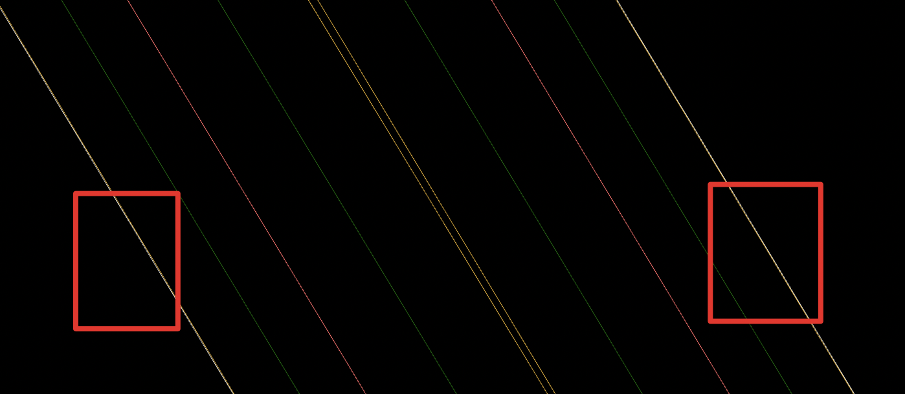
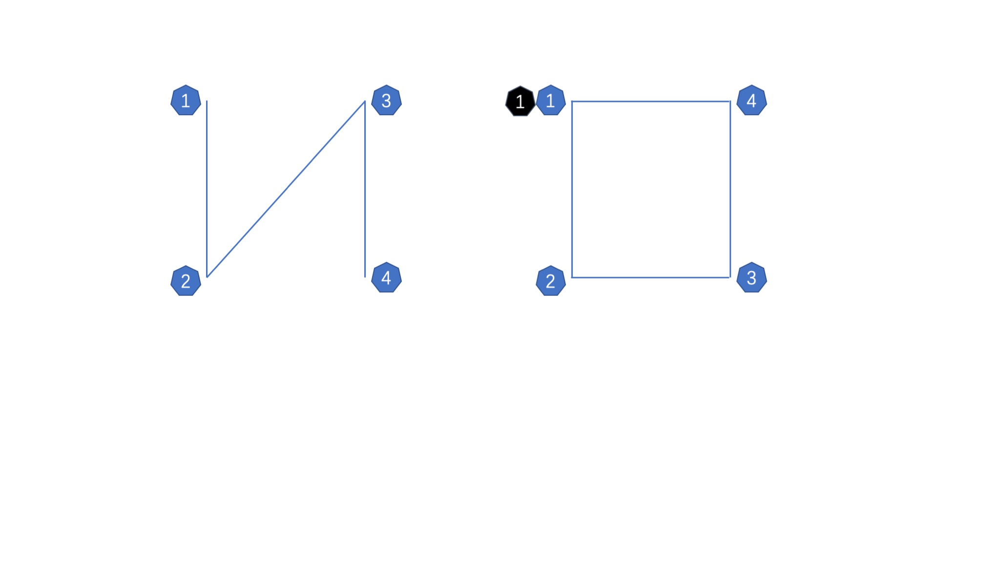

# 深入浅出自动驾驶中高精度地图数据的使用（1）

> 高精度地图是自动驾驶中的基础设施，地图的数据是有众多点信息组成。一般坐标系统使用世界坐标，这样很容易被3d软件展示。

## 使用点绘制面

下面是一组高精度地图数据样例：

```
{
    "x": 457382.120775907,
    "y": 4405077.27123374
},
{
    "x": 457389.013402718,
    "y": 4405066.14053764
}
```

在实际使用中，分为为`研发`和`用户`两种场景。研发更多追求对地图数据更丰富的显示，用户产品追求的是良好的用户体验和优美的显示效果。实际数据中，一般使用左右两组数据来标示一段路面。比如leftBoundary标示左边的标线，rightBoundary标志右边的标线。

如下图：



### for研发版本

我们使用`threejs`可以使用这样的方式来绘制`boundary`数据。

```javascript

let material = new THREE.LineBasicMaterial({
    color,
    linewidth,
    transparent,
    opacity
});
let geometry = new THREE.Geometry();

// 这里的point既是boundary数据，只要吧他设置给geometry的vertices属性即可。
geometry.vertices = point;

let lineSegment = new THREE.LineSegments(geometry, material);

```

### for用户体中版本

我们需要把点绘制成线在链接成面，在我们的认知中行程面是一个这样的过程。

> 点（1）-> 线（2点）-> 面（三线|三点）

上面我们说过一组boundary数据是有四个点组成的，那么我们可以这样做来绘制一个路面。



#### 问题
初始数据如左图，如果简单链接肯定是形成不了一个面的。


#### 数据加工

1.先把leftBoundray数据push到一个数组。
2.把rightBoundray数据翻转push
3.这是如果绘制会发现只能形成一个`凹`型线框并不能形成完整面。
4.我们去第一个点push进去这样绘制就可以形成一个面了。
5.用路径绘制一个二维平面可以使用[Shape](https://threejs.org/docs/index.html#api/zh/extras/core/Shape)

示例代码如下：

```javascript

function getShapeGeometryFromPoints(path) {
    let shape = new THREE.Shape();

    // 如果需要绘制弧度需要使用 shape.bezierCurveTo( 25, 25, 20, 0, 0, 0 );
    shape.setFromPoints(point);

    return new THREE.ShapeGeometry(shape);
}

road.forEach(edge => {
    let path = [];

    edge.forEach(({curve, type}) => {
        let point = curve.segment[0].lineSegment.point;

        this.drawAdge(point);

        if ('RIGHT_BOUNDARY' === type) {
            point = point.reverse();
            point.push(path[0]);
        }

        path = path.concat(point);
    });

    if (!path.length) {
        return;
    }

    let geometry = getShapeGeometryFromPoints(path);
    let material = new THREE.MeshLambertMaterial({
        color: 0x444444
    });
    let mesh = new THREE.Mesh(geometry, material);
});

```

那么通过以上5步操作我们可以得到一个完整的路面，实际效果如下。


