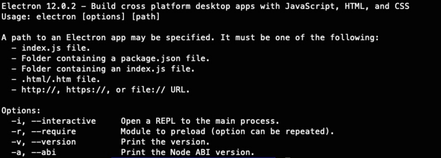

> 最近做一个Electron直播的项目，记录一下项目中的收获与心得与大家共同成长。

electrion的强大之处大家都有所耳闻，这里有不再赘述了。最典型的成功案例非`VS Code`众所周知我们搭建环境是成本很高的，在尝试了各种方案以后收获了很多。首先我们从官网的教程开始一步步完成一个`electron`项目。

## 1.安装`electron`

直接使用npm i electron的话有速度慢，卡死等多种问题。我们安装electron需要一些技巧!

### 方案1(官方方案)

```
ELECTRON_MIRROR="https://npm.taobao.org/mirrors/electron/"
ELECTRON_CUSTOM_DIR="{{ version }}"
npm i electron 
```

### 方案2（推荐方案）
```
npm i cnpm -g
cnpm i electron
```


运行 electron
```
electron
```



**看到以上画面即表示成功！！！** 使用方案2可以100%保证成功，已验证！

## 2.使用 `@electron-forge/cli` 可以快速搭建electron应用。

```
npm i -g @electron-forge/cli
```

### 2.1 转化已有项目
如果想要把已经存在的项目转化为`electron项目`，只需在该项目内运行

```
npx electron-forge import
```

npx electron-forge 会修改你的package.json添加必要的库和script命令，主线程的main.js需要自己添加，参考官网即可。


### 2.2 创建新的`electron`项目

```
mkedir test && cd test

npx electron-forge init
```
经过漫长的安装，项目终于创建好了。~~~~

**如果安装时间过长，一般来说是在本项目中安装`eletron`卡住了，此时可以强行推出，运行**`npm run start`
    

如果是这个错误，执行

```
cnpm i electron -D
npm run start
```

成功后`electron`会自动启动项目，看到这个界面即表示`electron`新项目初始化成功。


a. src/main.js 是`main`线程的入口文件。

b. src/main.js 中的index.html 是`renderer`线程的入口文件。


项目的目录结构如下


