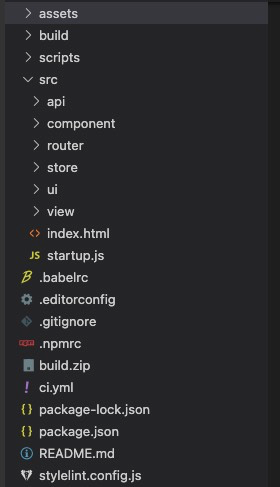
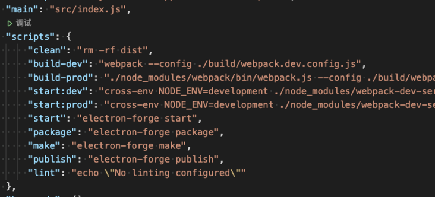
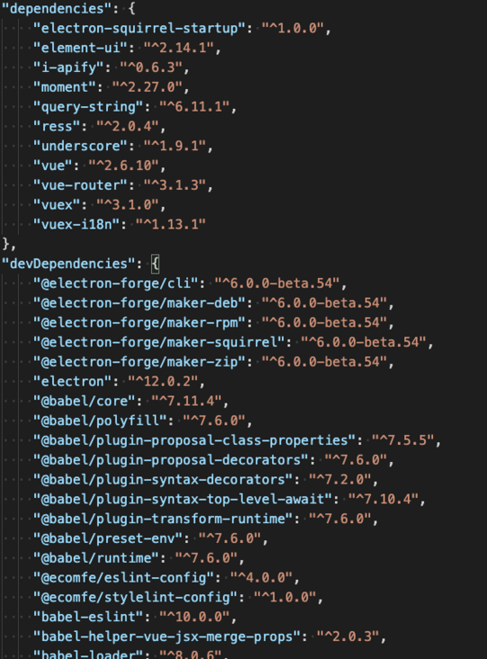
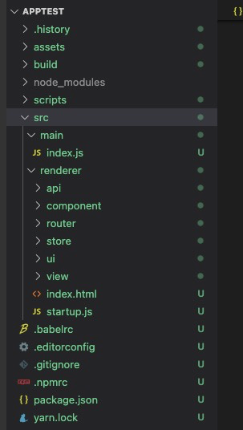
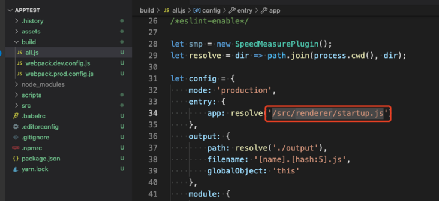
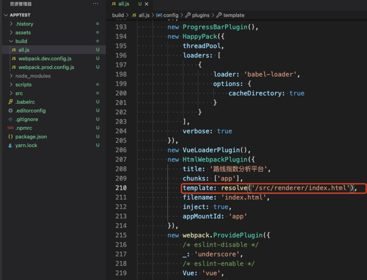
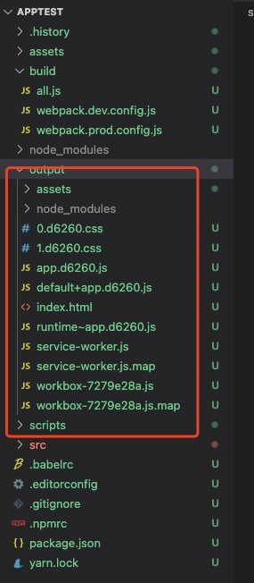
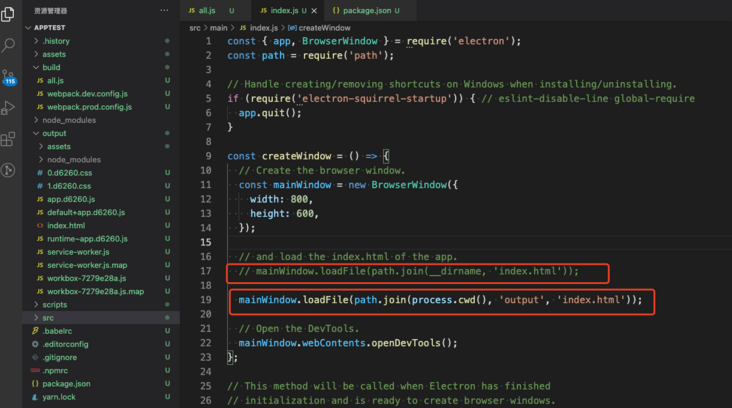
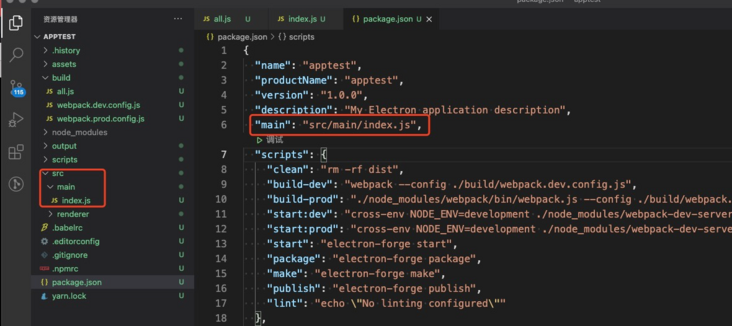
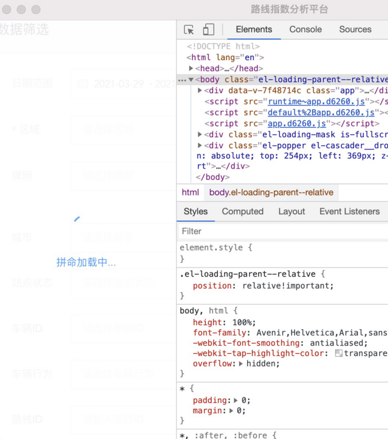

> 上一个篇章中讲了如何搭建一个electron项目，可以看到虽然我们成功的搭建了一个electron项目，但是离一个产品还很远。在这一篇章中我们将结合已有的vue项目来实现一个真实的electron商业应用。

# electron + Vue + Vuex + VueRouter

已有的Vue项目目录如下，做过Vue项目的同学们肯定都已经很熟悉了。


***注意！我们都是在electron项目中操作的！***

## 1.合并package.json

主要是求并集，但是要注意的是需要用electron项目为准绳来覆盖现有的vue项目，注意`main`节点非常重要。那么我开了两个VSC窗口来便于操作。



这个过程简单轻松。

## 2.改造项目结构

我们知道`electron` 分为 `main`和`renderer`两个线程，我们在src中创建两个目录来存放他们。

src
｜——main
｜——renderer

* 原来的src/inder.js 拖入到main目录
* vue项目中的src全部拖入renderer目录
* 删除原来src中的index.html和index.css
* 把vue项目中的assets、build、scripts拖入electron项目的根目录中
* 把vue项目中的.babelrc、.npmrc、 .editorconfig拖入electron项目的根目录中




**至此两个项目的源文件整合完成**

## 3.安装依赖库

我们只是把vue中的依赖写入了package.json 还没有安装，项目是无法运行的。

```
yarn install
```

## 4.改造webpack配置文件

由于我们修改了目录结构所以webpack配置文件也需要修改。




入口文件加一级`renderer`

## 5.产出renderer文件

```
npm run build-prod
```


## 6.修改main线程对renderer线程的引用



## 7.改造electron的入口文件


* 当然这里我们可以使用es6来开发main.js文件，然后使用node-loader来产出main.js到output来提升开发体验

## 8.大功告成

**启动我们的项目！**

```
npm run start
```



总结：通过7步我们就可以把现有的Vue项目改造成为`electron`项目，其实可以看出成本并不高。
