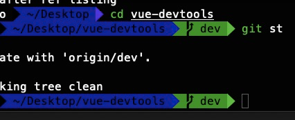
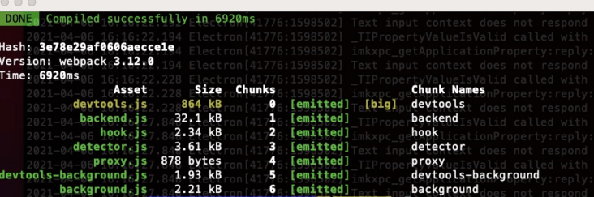
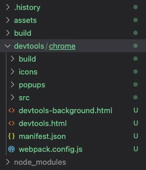
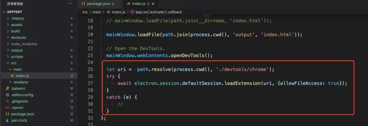
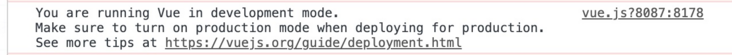
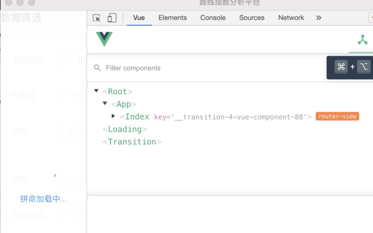

# Electron开发-使用vue-devtools

> 使用electron开发是很难不用到electron的模块，这样我们就没法在浏览器中来实时预览效果了。在electron中想要观察vue的状态怎么办？

# 在elctron项目中集成vue-devtools工具

如果你会集成vue-devtools那么react的也不在话下。

## 本地编译vue-devtools

1.github传送门[vue-devtools](https://github.com/vuejs/vue-devtools)

2.

* 注意默认dev分之，**需要切到`master`分之**
* 安装依赖
* 编译


我们需要的是

** /vue-devtools/shells/chrome **

把这个文件加考到我们前面几章搭建好的`electron`项目中的自建devtools目录中


## main线程中用插件加载vue-devtools(非常重要)

在main.js中这样加载vue-devtools


```ecmascript
let uri =  path.resolve(process.cwd(), './devtools/chrome');
try {
    await electron.session.defaultSession.loadExtension(uri, {allowFileAccess: true});
}
catch (e) {
  //
}
```

## 产出一份dev模式的代码


```
npm run start
```


成功加载，完美！！！